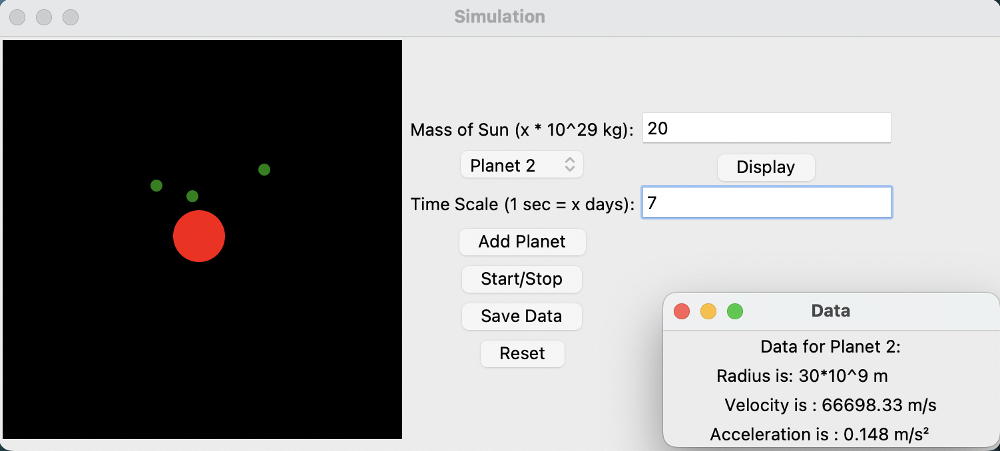

# Planetary Simulation

This is a simple planetary simulation built using Python and Tkinter. The simulation allows users to create planets orbiting a sun and observe their movements based on the entered parameters.

# Features

	•	Sun and Planets Simulation: Simulates planets orbiting around a sun with user-defined parameters.
	•	Add Planets: Add planets with a specified radius.
	•	Start/Stop Simulation: Control the simulation’s state.
	•	Display Planet Data: View data for each planet including radius, velocity, and acceleration.
	•	Save Data: Save the simulation data to a text file.
	•	Reset Simulation: Reset the simulation to its initial state.

